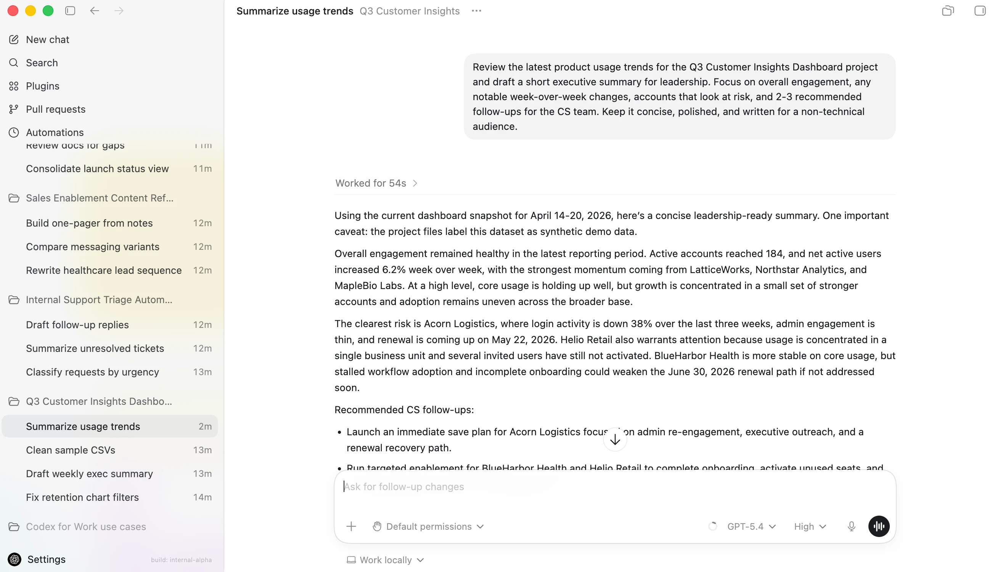

# 口播工厂 · Codex 配色刷新 Spec

状态：Scott 已确认，2026-07-14 已实施  
范围：只重做 App UI 配色与表面层级；保留现有布局、导航、卡片结构、路由、筛选、对比、预览和应用逻辑。

## 对标截图

来源：OpenAI Academy《How to get started with ChatGPT Codex》，2026-04-23。

## 方向

Codex light-first 冷中性工作台。主画布为真实白，导航和次级表面用浅灰分层；App chrome 几乎不使用品牌色，真实视频 poster 是页面里唯一高饱和内容。颜色策略为 `Restrained`。

## 色板

| 角色 | 色值 | 用途 |
|---|---|---|
| `--bg` | `oklch(1 0 0)` / `#ffffff` | 主画布 |
| `--surface` | `oklch(0.975 0.002 270)` / `#f7f7f8` | 侧栏、面板 |
| `--surface-2` | `oklch(0.955 0.003 270)` / `#f0f0f2` | hover、选中、次级控件 |
| `--inset` | `oklch(0.94 0.003 270)` / `#ebebed` | 输入、日志凹面 |
| `--line` | `oklch(0.88 0.004 270)` / `#dadade` | 标准分隔线 |
| `--line-soft` | `oklch(0.93 0.003 270)` / `#e9e9ec` | 弱分隔线 |
| `--control-line` | `#85858b` | 输入与下拉边界，满足非文字 3:1 |
| `--text` | `oklch(0.22 0.004 270)` / `#1b1b1e` | 主文字 |
| `--text-2` | `oklch(0.45 0.006 270)` / `#62636a` | 次文字，满足 AA |
| `--dim` | `#68696f` | 弱文字与 placeholder，最深输入表面仍满足 AA |
| `--accent` | `oklch(0.22 0.004 270)` / `#1b1b1e` | 主行动、键盘 focus |
| `--accent-soft` | `oklch(0.92 0.004 270)` / `#e5e5e8` | 当前项、选中态 |
| `--ok` | `#147a45` | 成功 |
| `--warn` | `#925b00` | 警告 |
| `--bad` | `#b42318` | 错误 |
| `--info` | `#205dd8` | 信息与可交互链接 |

## 字体与控件

- 字体保持单一家族：`-apple-system, BlinkMacSystemFont, "SF Pro Text", "PingFang SC", sans-serif`；技术 ID 和日志使用 `SF Mono`。
- 不改现有字阶；按钮主行动改为黑底白字，普通 hover 只用浅灰 fill。
- 选中态使用浅灰底和黑字，不再使用琥珀描边。
- 深色视频 poster 保持原样，不对成片预览套灰度或 tint。

## 三个禁止项

1. App chrome 禁止再出现暖棕、琥珀或橙色；模板 poster 内原色不受限制。
2. 禁止渐变 logo、装饰性玻璃和大面积彩色阴影；层级只靠白、浅灰与 1px 分隔线。
3. 禁止把状态做成高饱和彩色块；语义色只用于小图标、文字和必要的轻底色。

## 验收

- 视觉库目录、详情、对比、空状态、失败状态和视频项目页统一使用同一色板。
- 1440×900 与 1024×768 实机截图中，第一眼先看到 poster，而不是 App chrome。
- 正文与控件文字达到 WCAG AA；focus 可见；disabled、hover、active、selected 状态可区分。
- 所有原有功能测试不回退；配色变更不修改组件 registry、preview cache 或 apply API。

## 实机结果

- [视觉库 · 1440×900](assets/design-references/codex-color-refresh-library-1440x900.jpg)
- [组件详情 · 1440×900](assets/design-references/codex-color-refresh-detail-1440x900.jpg)
- [YouTube 横屏套装 · 1440×900](assets/design-references/codex-color-refresh-youtube-1440x900.jpg)
- [组件对比 · 1440×900](assets/design-references/codex-color-refresh-compare-1440x900.jpg)
- [视频项目 · 1440×900](assets/design-references/codex-color-refresh-projects-1440x900.jpg)
- [视觉库 · 1024×768](assets/design-references/codex-color-refresh-library-1024x768.jpg)

浏览器实测无 console error；1024×768 下 `scrollWidth === clientWidth`，无横向溢出。`npm run test:visual-library` 共 24 项通过，其中 3 项专门锁定 Codex 浅色 tokens、文字/控件对比度和禁止项。
