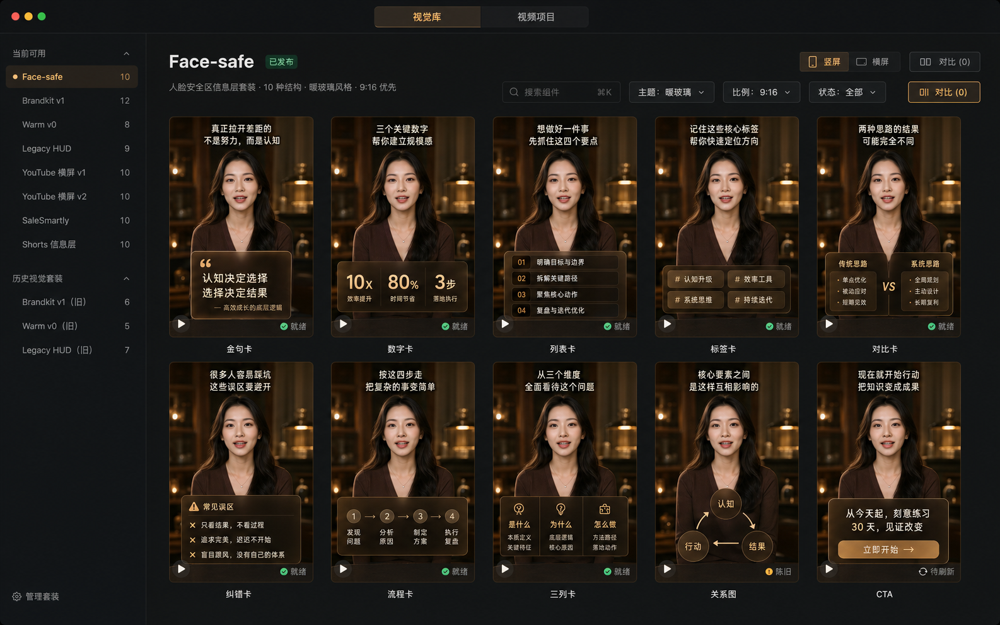

# 视觉组件目录 · Design spec

状态：2026-07-13 已确认。实现必须同时覆盖抖音竖屏与 YouTube 横屏。

## 产品结果

Scott 打开 App 后，不读代码、不打开 JSON，就能看见以前做过的全部视觉套装；在同一真人、同一文案、同一主题与同一画幅下比较组件，并把可用组件应用到当前视频。组件的新增和修改仍由 Codex、Claude 或 CLI 完成；App 只负责自动发现、真实展示、诊断、比较和选择。

资产严格分为 `theme`、`component`、`layout`、`preset`、`legacy-composition`。当前可用与历史资产都展示；历史、损坏或不支持应用的资产不能被静默过滤。

## 已确认的北极星截图



借鉴的是三种产品逻辑，而不是复制其品牌外观：

- Figma：资产列表与选择状态清楚，详情不埋在任务流程里。
- Storybook：同一组件用标准 fixture 展示正常、长文案、数字和中英混排状态。
- DaVinci Resolve：真实画面占据视觉中心，工具界面退后。

实现不照搬截图中的生成式人物、虚构数量或假文案；全部替换为仓库实时扫描结果与冻结的真实 A-roll fixture。

## 信息架构

```text
口播工厂
├── 视觉库（默认）
│   ├── 视觉套装列表
│   ├── 套装内组件图库
│   ├── 组件详情
│   └── 2–4 项同条件对比
└── 视频项目
    └── 现有五工位
```

视觉库一次进入一套视觉家族。主区默认显示该套全部组件，不把不同家族混成无上下文的组件海洋。顶部筛选：搜索、主题、画幅、生命周期、兼容性和健康状态。

当前 `beats-v2 / face-safe` 同时支持：

- 9:16：全幅人物 + 底部安全卡 + 字幕上移避让。
- 16:9：左侧解释区 + 右侧人物 + 独立横屏字幕区。

`YouTube 横屏 v1` 与 `YouTube 横屏 v2` 是独立历史视觉家族，不折叠成竖屏模板的别名。横屏必须由同一 A-roll 母版重排，不能从竖屏成片二压。

## 核心界面

### 目录

- 真实 poster 占资产卡至少 80%。
- hover 或键盘聚焦后才加载 3–5 秒真实 HyperFrames loop；离屏后释放。
- 一张失败不能拖垮整页。`missing`、`stale`、`rendering`、`failed`、`unsupported` 均保留卡片。
- 历史视觉套装显示结构数量、来源、替代项和不能应用的原因。

### 详情

- 大播放器；主题、9:16/16:9、fixture 切换。
- 竖横屏可以并列查看；不支持的画幅明确显示 `unsupported`。
- 展示用途、字段、来源文件、版本、使用记录、预览状态与错误。
- 动作只保留：应用到当前视频、加入对比、刷新预览、复制 Codex 指令、打开源文件。

### 对比

- 最多四项同步播放。
- 组件比较锁定同一真人、文案、主题、画幅与时间。
- 按用户确认，主题不做独立“色板比较”模式；在目录或详情里一套一套切换，组件比较期间锁定当前主题与 fixture。
- 不提供跨 kind 的伪比较。

## App 外壳视觉

每套视频模板拥有自己的色板；以下颜色只属于 App 外壳，不覆盖模板预览：

- 背景：`oklch(0.17 0.014 65)`。
- 面板：`oklch(0.21 0.016 65)`。
- 次面板：`oklch(0.24 0.02 68)`。
- 主文字：`oklch(0.93 0.02 80)`。
- 次文字：`oklch(0.76 0.03 75)`。
- 选中/主行动：`oklch(0.83 0.09 70)`；面积控制在界面 10% 内。
- 成功、警告、错误沿用既有语义色；不把资产主题色用于 App chrome。

字体只用 `Inter, -apple-system, BlinkMacSystemFont, "PingFang SC", sans-serif`。固定 `rem` 字阶 12/14/16/20；技术 id 和日志才使用等宽字体。正文不低于 1rem，辅助标签可用 0.75–0.875rem。

## 状态与行为

- `lifecycle`：`draft | published | archived`。
- `compatibility`：`supported | preview-only | unsupported`。
- `health`：扫描计算 `ok | warning | error`，不回写源 manifest。
- `preview.state`：`ready | missing | stale | rendering | failed | unsupported`。
- 可应用条件：`published + supported + apply.mode != none`。
- 刷新时保留 last-good poster；失败显示短错误、日志路径、重试与修复指令。
- 所有按钮、筛选、资产卡具备 default/hover/focus/active/disabled/loading/error/success 状态；触达区至少 40px。
- 动效只表达状态，150–240ms ease-out；支持 `prefers-reduced-motion`。

## 三个禁止项

1. 禁止把视觉库重新塞回单条视频的“包装”工位；它必须是一级入口。
2. 禁止用色块、假图或另一套近似 renderer 冒充真实组件预览；预览必须调用生产 renderer。
3. 禁止为了“无代码”引入拖拽画布或设置墙；组件创作走 Codex/Claude/CLI，App 专注展示。

## 验收

- 当前 10 个组件在 6 个主题、9:16 与 16:9 下可见并可切换。
- 9 套已盘点视觉家族全部出现；损坏和历史资产也可见。
- 新增第 11 个组件只新增组件目录，App、builder 和任务卡无需改名单。
- 目录 poster-first；详情和对比才懒加载动态预览，最多四路同步播放。
- 组件可应用到当前 job；YouTube 横屏写入横屏 variant，竖屏写入竖屏 variant。
- manifest 损坏、预览过期、生成失败和不支持画幅均有可操作错误状态。
